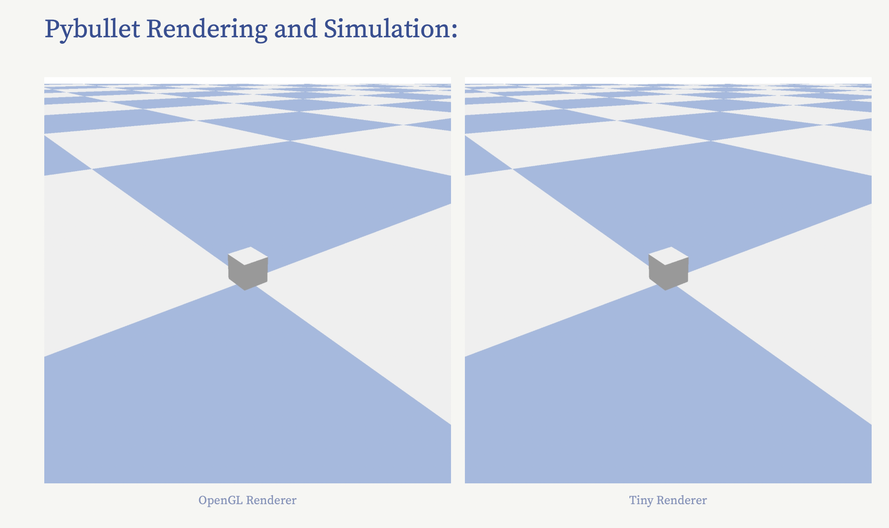

# Rendering and Physics Simulation in low code web app
This code implements the physics simulation framework pybullet into a streamlit UI for easy web server development and custom formatting of results. This project is written in [Pure Python]() in under 100 lines of code. Created by Brian Lesko for Learning Purposes.

&nbsp;

<div align="center"></div>

&nbsp;

## Usage

Run the following commands:
```
pip install --upgrade streamlit libusb hidapi matplotlib modern_robotics
streamlit run [REPLACE with github raw link to code]
```

This will start the local Streamlit server, and you can access the chatbot by opening a web browser and navigating to `http://localhost:8501`.

&nbsp;

## Repository Structure
```
repository/
├── app.py # the code and UI integrated together live here
├── customize_gui # class for adding gui elements
├── requirements.txt # the python packages needed to run locally
├── .gitignore # includes the local virtual environment named my_env
├── .streamlit/
│   └── config.toml # theme info for the UI
└── docs/
    └── preview.png # preview photo for Github
```

&nbsp;

## Topics 

I first discovered pybullet, the simulation engine and rendering tools from a google project called Kubric, which could provide semi realistic videos. Thinking this was cool, I decided to get a small scale pybullet sim viewable from my favorite web app development library, Streamlit

```
Simulation | Pybullet | Physics simulation 
Python | Streamlit | Git | Low Code UI | control | real-time | real time control
Mechanical engineer | Robotics engineer
```
&nbsp;

<hr>

&nbsp;

<div align="center">


╭━━╮╭━━━┳━━┳━━━┳━╮╱╭╮        ╭╮╱╱╭━━━┳━━━┳╮╭━┳━━━╮
┃╭╮┃┃╭━╮┣┫┣┫╭━╮┃┃╰╮┃┃        ┃┃╱╱┃╭━━┫╭━╮┃┃┃╭┫╭━╮┃
┃╰╯╰┫╰━╯┃┃┃┃┃╱┃┃╭╮╰╯┃        ┃┃╱╱┃╰━━┫╰━━┫╰╯╯┃┃╱┃┃
┃╭━╮┃╭╮╭╯┃┃┃╰━╯┃┃╰╮┃┃        ┃┃╱╭┫╭━━┻━━╮┃╭╮┃┃┃╱┃┃
┃╰━╯┃┃┃╰┳┫┣┫╭━╮┃┃╱┃┃┃        ┃╰━╯┃╰━━┫╰━╯┃┃┃╰┫╰━╯┃
╰━━━┻╯╰━┻━━┻╯╱╰┻╯╱╰━╯        ╰━━━┻━━━┻━━━┻╯╰━┻━━━╯
  


&nbsp;


<a href="https://twitter.com/BrianJosephLeko"></a> &nbsp; &nbsp; &nbsp; &nbsp; &nbsp; &nbsp; <a href="https://github.com/BrianLesko"></a> &nbsp; &nbsp; &nbsp; &nbsp; &nbsp; &nbsp; <a href="https://www.linkedin.com/in/brianlesko/"></a>

follow all of these for a cookie :)

</div>


&nbsp;


